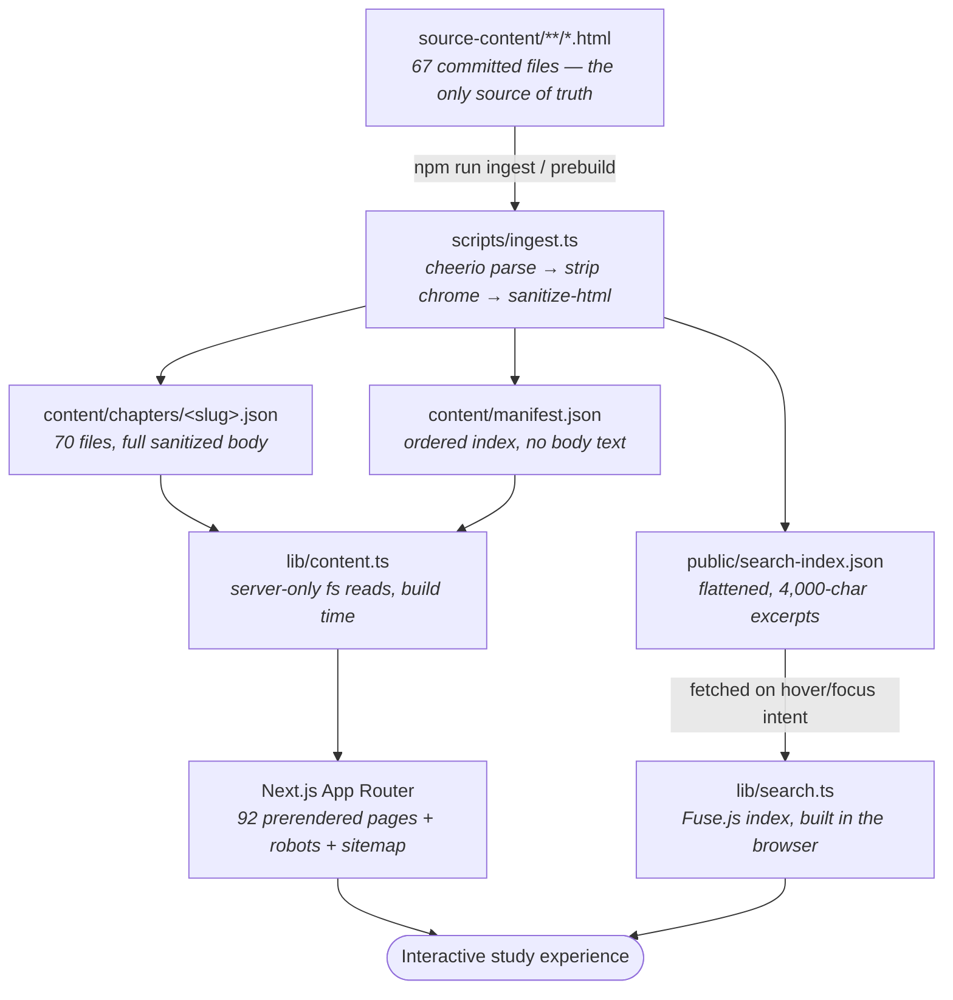

# Claude Certified Architect — Study Guide

**An interactive, fully static study site for the Claude Certified Architect (CCAR) exams, built from a corpus of static HTML study notes.**

A Next.js application that ingests 67 hand-written HTML study-note files at build time and turns them into 70 navigable chapters with fuzzy search, per-chapter progress tracking, a scroll-aware table of contents, and light/dark themes. All reading progress lives in your browser — there is no backend, no account, and no environment variables.


**Repository:** <https://github.com/NiravRVaghasiya/Claude-Certified-Architect>

> [!NOTE]
> **No live demo.** This repository does not link to a public deployment. A `ccar-study.vercel.app` hostname is hardcoded as an SEO base URL in three source files, but it is **not** a deployment of this project — see [Deployment](#deployment) before you ship.

> [!IMPORTANT]
> This is an **independent, community-created** study resource. It is not affiliated with, endorsed by, or reviewed by Anthropic. See [Disclaimer](#disclaimer).

---

## Overview

The CCAR study material in this repository started life as 67 standalone HTML pages — each one self-contained, each one using a slightly different page layout, with no shared navigation, no search, and no way to tell what you had already read.

This project turns that pile of files into a single study application:

| Problem | What this repo does about it |
| --- | --- |
| 67 disconnected HTML files | A build step normalizes all of them into one chapter model with a stable ordering |
| No way to find anything | A weighted client-side fuzzy index over titles, section headings, deks and a 4,000-character body excerpt |
| No sense of progress | Per-chapter completion, streaks and remaining-reading estimates, stored locally |
| Inconsistent source markup | ~105 kB of hand-written CSS re-skins the notes' own class vocabulary onto one theme |
| Hard to read on a phone | A responsive reader with a collapsible TOC and a mobile navigation drawer |

**Who it's for**

- **Certification candidates** preparing for the *Claude Certified Architect – Foundations* (CCAR-F) or *Professional* (CCAR-P) exams who want the material as a browsable, searchable, progress-tracked site.
- **Developers** who want a small, dependency-light reference for an HTML-ingestion → static-site pipeline in the Next.js App Router.

**Why it works as a study resource:** every chapter is a full static page with its own metadata, all 70 chapters are prerendered at build time, and the entire progress model is client-side — so pages load fast and your study history stays on your own device. (There is no service worker, so it is not an offline/installable PWA.)

---

## Key Features

**Reading**

- **70 chapters** across three tracks and 16 track/domain groups, all statically prerendered.
- **Scroll-spy table of contents** — driven by `IntersectionObserver`, with a sticky rail at `xl` and up and a collapsible "On this page" disclosure below it.
- **Reading-progress rail** measured against the article element (not the document), so the footer can't inflate it to 100%.
- **Related concepts** — up to four same-domain chapters, topped up with reading-order neighbours.
- **Prev/next navigation** in global chapter order, plus breadcrumbs on chapter, track and domain pages.

**Search**

- **⌘K / Ctrl+K command palette** available on every route, plus a dedicated `/search` page.
- One shared **Fuse.js** index with weighted keys (title `0.4`, section headings `0.25`, dek `0.15`, domain `0.1`, body excerpt `0.1`).
- Range-based **match highlighting** (literal matches first, Fuse match indices as fallback) — rendered as React elements, never `dangerouslySetInnerHTML`.
- Designed **idle / loading / empty / error** states, a retryable error path, and a separate mobile top-sheet layout.
- Results grouped by track with per-track hit counts and an additive track filter on `/search`.

**Progress**

- Per-chapter completion, **last-visited chapter**, **day streak**, and **estimated reading time remaining**.
- Persisted to `localStorage` under four versioned keys (`ccar:progress:v1`, `ccar:last-visited:v1`, `ccar:completed-at:v1`, `ccar:activity:v1`).
- Every write merges with what's already in storage, so a chapter opened before the provider hydrates can't erase history; corrupt values fall back to empty defaults instead of crashing.
- Progress surfaces on the dashboard, track/domain pages, the chapter rail, search results and the header.

**Code blocks**

- Chapter `<pre>` elements are upgraded after hydration into a code-block component with a copy button, plus a chrome strip carrying a caption and/or language badge whenever ingestion found one. The pass is idempotent (`data-code-enhanced`), and its DOM rearrangement is undone when the chapter changes.
- Syntax highlighting comes from `lib/highlight.ts`, a **dependency-free tokenizer** covering `json`, `yaml`, `bash`, `python` and `typescript` (plus an escaped-but-unstyled `text` passthrough). Language is *inferred* — the source notes carry no language metadata.
- Blocks that already ship their own token spans, author-drawn ASCII/SVG art, and blocks that don't score high enough to name a language are never re-tokenized; they keep the source's own styling and get the copy affordance only.
- Copy uses `navigator.clipboard` with an `execCommand` fallback, and shows a manual ⌘C/Ctrl+C hint rather than claiming a success it didn't get.

**Interface**

- **Light / dark themes** via `next-themes` (class strategy) over 55 design-token custom properties — 45 of them HSL colours — with a `.dark` counterpart for every non-code colour, surface and shadow token. System preference is the default; the toggle itself is a two-state light↔dark switch.
- **Reduced motion** handled at three layers: `<MotionConfig reducedMotion="user">` app-wide, a `prefers-reduced-motion` CSS block, and a `useMotionSafe()` gate for effects where the animation *is* the feature.
- **Responsive** throughout: a Radix-backed mobile drawer below `lg`, a two-layout command palette, and mobile-first `min-width` media queries in the chapter stylesheets.
- **Accessibility**: a working skip link, exactly one `<main>` per route, labelled landmarks, `aria-current` / `aria-expanded` / `aria-live` where they belong, a global `:focus-visible` ring, and horizontally overflowing tables/code/diagrams made keyboard-scrollable by a `ResizeObserver` (and un-made when they fit again).
- **Motion tokens** in `lib/motion.ts` — a documented four-level duration scale, seven named springs and three easing curves, imported by every component that animates.

**Build & SEO**

- Everything is prerendered: 92 static pages — 70 chapters, 16 domains, 3 tracks, the dashboard, `/search` and the 404 — plus a `/robots.txt` and a `/sitemap.xml` generated from the ingested manifest.
- Per-chapter `generateMetadata` (title, description, OpenGraph), self-hosted fonts via `next/font`, and **zero environment variables**.

---

## Study Content

The content is committed as HTML under `source-content/`. Its directory layout *is* the data model: the folder a file sits in determines its track and domain, and its filename determines its chapter number.

### Tracks

| Track | Chapters | Domains | Words | Est. reading time |
| --- | --: | --: | --: | --: |
| **Core** | 5 | 2 | ~7.7k | ~42 min |
| **Foundation** (CCAR-F) | 34 | 6 | ~168k | ~14 h |
| **Professional** (CCAR-P) | 31 | 8 | ~116k | ~10 h |
| **Total** | **70** | **16** | **~291k** | **~25 h** |

<sub>Reading times are estimates the build computes as `max(1, ceil(words / 200))` — a flat 200 wpm over every word, including code, tables and diagram labels. Treat them as relative weights, not schedules.</sub>

### Domains

| Track | Domain | Chapters |
| --- | --- | --- |
| Core | Ecosystem Overview | 1 |
| Foundation | Agentic Architecture & Orchestration | 2–6 |
| Foundation | Tool Design & MCP Integration | 7–11 |
| Foundation | Claude Code Configuration & Workflows | 12–17 |
| Foundation | Prompt Engineering & Structured Output | 18–23 |
| Foundation | Context Management & Reliability | 24–29 |
| Foundation | CCAR-F Exam Scenarios & Practice | 30–35 |
| Professional | Solution Design & Architecture | 36–39 |
| Professional | Claude Models, Prompting & Context Engineering | 40–43 |
| Professional | Integration | 44–47 |
| Professional | Evaluation, Testing & Optimization | 48–52 |
| Professional | Governance, Safety & Risk Management | 53–57 |
| Professional | Stakeholder Communication & Lifecycle Management | 58–62 |
| Professional | Developer Productivity & Operational Enablement | 63–65 |
| Professional | Sample Questions & Practice | 66 |
| Core | Exam Strategy & Roadmaps | 67–70 |

> [!WARNING]
> **"16 domains" is a property of this repository, not of the exams.** Twelve of these groups come from `Domain N …` folders in the source notes (5 under Foundation, 7 under Professional). The remaining four are supplementary buckets — and `Sample Questions & Practice` is *synthesised by the build script* for loose files at a track root. Do not read this table as an exam blueprint; check the official certification resources for that.

### Suggested entry points

Nothing in the app enforces an order, but the corpus has obvious starting points: **chapter 1** orients you in the Claude ecosystem, **chapters 67–68** are the CCAR-F and CCAR-P study roadmaps, **69–70** are preparation exercises, **30–35** are six Foundation scenario walkthroughs, and **66** is a Professional sample-question set. The roadmap chapters sit in the *Core* track, which the homepage renders below the two certification tracks.

### Content caveats

These are consequences of how ingestion works, and they are worth knowing before you study from this:

- **Quiz answers are always visible.** The source notes wrap 216 answer/rationale reveals in `<details>`/`<summary>` across 30 files, and those tags are not in the sanitizer's allowlist — so every answer renders open. You cannot self-test by hiding them here.
- **Body-text search is not full-text.** The search index stores only the **first 4,000 characters** of each chapter's plain text. Since no chapter is that short, deep matches are only reachable via title, dek, section heading or domain.
- **Search results name a section but can't jump to it.** Ingestion keeps section *titles* in the index and drops their ids, so every hit navigates to the top of the chapter.
- **Progress is per-browser.** There is no sync, no export and no import. Clearing site data destroys it.

---

## Architecture & Content Pipeline

The defining piece of this project is the build-time ingestion step. `scripts/ingest.ts` (485 lines) is the only thing that reads `source-content/`; the application never parses HTML at runtime.



### What ingestion actually does

1. **Enumerates sources.** The two track directories are matched by exact name; the two root-level files by a `Ch.1 ` filename prefix and the exact name `CCAR Study Guide.html`. Domains are derived from folder names (`Domain 3 - CLAUDE CODE …` → key `claude-code-configuration-workflows`).
2. **Finds chapters.** Most files hold one chapter, and its **number comes from the filename** (`Ch.7 — …`) because the source `<h1>`s are inconsistent about repeating it. The one bundled file, `CCAR Study Guide.html`, holds chapters **67–70** and is split on `<h2 id="chNN">` boundaries — there, both number and title are parsed from the heading.
3. **Strips the notes' own chrome.** `header`, `nav`, `aside`, the `<h1>`, chapter badges, in-body tables of contents and back-to-top links are removed, then emptied wrapper divs are pruned — the application renders its own navigation.
4. **Builds a TOC.** Remaining `h2`/`h3` elements get stable, de-duplicated ids written back onto the element so in-page anchors resolve. The current corpus yields 1,817 section headings.
5. **Sanitizes.** `sanitize-html` with a 48-tag allowlist that deliberately includes 17 inline-SVG tags and preserves camelCase attributes (`viewBox`, `markerWidth`), which is what keeps the notes' architecture diagrams rendering. This is the **only** sanitization pass — the reader injects the result with the app's single `dangerouslySetInnerHTML`.
6. **Fails the build on a content gap.** After sorting by chapter number, the script throws `Chapter integrity check failed. Missing: […]. Duplicated: […].` if any number from 1 to the highest one observed is absent or seen twice. It also throws on an unparseable heading, an undeterminable chapter number, an empty title, or a missing `<h1>`.
7. **Prints a summary** — total chapters, source-file count, and a per-track-and-domain breakdown (16 rows today).

### Source vs. generated

| Path | Status | Edit it? |
| --- | --- | --- |
| `source-content/**/*.html` | **Committed source** (67 files) | ✅ Yes — this is the study material |
| `scripts/ingest.ts` | **Committed source** | ✅ Yes — the parser/normalizer |
| `app/`, `components/`, `lib/` | **Committed source** | ✅ Yes — the application |
| `content/manifest.json` | Generated, gitignored | ❌ Never |
| `content/chapters/*.json` | Generated, gitignored | ❌ Never |
| `public/search-index.json` | Generated, gitignored | ❌ Never |

> [!CAUTION]
> `content/` is **deleted outright** (`fs.rmSync(…, { recursive: true, force: true })`) at the start of every ingest run, and `public/search-index.json` is overwritten. Any hand-edit to those files is lost on the next build.

---

## Tech Stack

| Technology | Purpose |
| --- | --- |
| **Next.js 14** (App Router) | Routing, static prerendering, `generateMetadata`, `robots.ts` / `sitemap.ts` |
| **React 18** | Server components for the shell, client islands for search, progress and code blocks |
| **TypeScript 5** | `strict` + `noEmit` type checking across the app and the ingest script |
| **Tailwind CSS 3.4** | Utility styling over the HSL design tokens; `darkMode: "class"` |
| **@tailwindcss/typography** | Prose defaults, re-themed through the app's own tokens |
| **Framer Motion 11** | Route transitions, travelling `layoutId` indicators, scroll-linked progress |
| **next-themes** | Light/dark theme switching (system preference as the default) with no hydration flash |
| **Fuse.js 7** | Weighted client-side fuzzy search with match indices for highlighting |
| **cmdk** + **@radix-ui/react-dialog** | Command-palette listbox semantics; dialog focus trap, Escape and scroll lock |
| **@radix-ui/react-slot** | `asChild` composition in the `Button` primitive |
| **lucide-react** | Icon set |
| **clsx** + **tailwind-merge** + **class-variance-authority** | The `cn()` helper and variant-driven `Button` / `Badge` / `Card` primitives |
| **cheerio** *(build only)* | Parses the source HTML during ingestion |
| **sanitize-html** *(build only)* | Tag/attribute allowlist applied once, at build time |
| **tsx** *(build only)* | Runs `scripts/ingest.ts` directly, with no separate compile step |

Syntax highlighting is **not** a dependency — `lib/highlight.ts` is a hand-written tokenizer with no imports at all.

---

## Project Structure

```
.
├── app/                              # Next.js App Router
│   ├── page.tsx                      # Dashboard: progress metrics, tracks, resume card
│   ├── layout.tsx                    # Theme/motion/progress providers, header, chapter rail
│   ├── template.tsx                  # Per-navigation route transition
│   ├── not-found.tsx                 # 404
│   ├── chapters/[slug]/page.tsx      # Chapter reader (the only route importing the prose CSS)
│   ├── tracks/[track]/page.tsx       # Track landing page — lists its domains
│   ├── tracks/[track]/[domain]/…     # Domain landing page — lists its chapters
│   ├── search/page.tsx               # Full search page with track filters
│   ├── robots.ts, sitemap.ts         # Generated from the ingested manifest
│   ├── globals.css                   # Design tokens, base type, utilities
│   ├── chapter-prose.css             # Source-notes markup → tokens (base layer)
│   └── chapter-blocks.css            # Exam panels, diagrams, cheat sheets (rich layer)
├── components/
│   ├── animations/                   # MotionProvider, AnimatedPage/Section/Number/Check, Magnetic
│   ├── chapter/                      # Header, body, TOC, reading progress, related, visit tracker
│   ├── code/                         # Code-block chrome, copy button
│   ├── dashboard/                    # Metrics, continue card, page header, track/domain/chapter cards
│   ├── navigation/                   # Site header, chapter rail, mobile drawer, breadcrumbs, prev/next
│   ├── progress/                     # Ring, bar, mark-complete button
│   ├── search/                       # ⌘K palette, shared result row, highlight ranges
│   ├── ui/                           # Button, card, badge, kbd, dialog, theme toggle
│   └── theme-provider.tsx            # next-themes wrapper
├── lib/
│   ├── content.ts                    # Server-only reads of the generated content + grouping/stats
│   ├── search.ts                     # Cached client-side Fuse index
│   ├── progress.tsx                  # localStorage-backed progress context
│   ├── highlight.ts                  # Dependency-free syntax tokenizer
│   ├── motion.ts, use-motion.ts      # Duration/spring/easing tokens and motion-safety hook
│   ├── nav.ts, dek.ts, types.ts      # Route→content resolver, dek normalization, shared types
│   └── utils.ts                      # cn() helper
├── scripts/
│   └── ingest.ts                     # The content pipeline (build-time only)
├── source-content/                   # ✅ Committed study notes — 67 HTML files
│   ├── Ch.1 - Introduction to Claude Architecture.html
│   ├── CCAR Study Guide.html          #    bundles chapters 67–70
│   ├── Claude Certified Architect - Foundation/…
│   └── Claude Certified Architect - Professional/…
├── content/                          # ⚙️ Generated, gitignored
├── public/                           # ⚙️ Holds only the generated search-index.json (that file is gitignored)
├── package.json                      # Scripts, dependencies, engines (node >=20.9.0)
├── tsconfig.json                     # strict, noEmit, @/* path alias
├── next.config.mjs                   # reactStrictMode only
├── tailwind.config.ts                # Token → Tailwind mapping
├── postcss.config.js                 # tailwindcss + autoprefixer
├── .eslintrc.json                    # extends next/core-web-vitals
├── components.json                   # shadcn/ui generator config
├── vercel.json                       # Pins npm install/build + the nextjs preset
└── .nvmrc                            # 20.9.0
```

`public/` does not exist in a fresh clone — the ingest script creates it.

---

## Getting Started

### Prerequisites

- **Node.js ≥ 20.9.0** (pinned in `.nvmrc` and `package.json` `engines`)
- **npm** — `vercel.json` pins npm for install and build. No lockfile is committed, so any npm-compatible client works locally; `bun.lock` is present but deliberately gitignored.

### Setup

```bash
git clone https://github.com/NiravRVaghasiya/Claude-Certified-Architect.git
cd Claude-Certified-Architect

npm install
npm run ingest    # required once — see below
npm run dev
```

Then open <http://localhost:3000>.

> [!IMPORTANT]
> **Run `npm run ingest` before your first `npm run dev`.** `content/` is gitignored, and the root layout reads the generated manifest from disk — so on a fresh clone the dev server throws before *any* route can render, including `/search` and the 404 page. There is no `predev` hook; only `npm run build` regenerates content automatically (via `prebuild`).

### Production build

```bash
npm run build     # runs ingest via prebuild, then next build
npm start
```

No environment variables are required — `process.env` is not read anywhere in the application, the ingest script or the config.

---

## Available Scripts

| Command | What it does |
| --- | --- |
| `npm run dev` | Starts the Next.js dev server. **Does not** run ingestion. |
| `npm run ingest` | Regenerates `content/` and `public/search-index.json` from `source-content/`. |
| `npm run prebuild` | Identical to `ingest`; npm runs it automatically before `build`. |
| `npm run build` | Ingests, then builds — prerenders 92 pages plus `robots.txt` and `sitemap.xml`. |
| `npm start` | Serves the production build. |
| `npm run lint` | `next lint` (`next/core-web-vitals`). |
| `npm run typecheck` | `tsc --noEmit` in strict mode. |

There is **no test suite and no CI configuration** in this repository. `lint` and `typecheck` are the only automated checks; both pass on the current tree.

<sub>Note: `typecheck` on a never-built clone covers slightly less than after a build, because `tsconfig.json` includes the generated `next-env.d.ts` and `.next/types/**`.</sub>

---

## Content Development Workflow

**Where do I edit content?** In `source-content/`. Always. Never in `content/` or `public/search-index.json` — those are regenerated and `content/` is deleted on every run.

**What happens when I run the build?** `npm run build` triggers `prebuild` → `tsx scripts/ingest.ts`, which re-parses every source file, re-derives the manifest and search index, fails loudly if the chapter numbering has a hole, and only then hands off to `next build`.

### Fixing a typo in a chapter

1. Find the file in `source-content/` (the chapter number is in the filename).
2. Edit the HTML.
3. `npm run ingest && npm run dev` — or just `npm run build`.

### Adding a chapter

The script's file matching is intentionally strict, so filenames and folder names carry meaning:

| Rule | Detail |
| --- | --- |
| **Chapter number** | Taken from the filename prefix `Ch.<number>`. The separator after it doesn't matter — `Ch.8 - …`, `Ch.22_ …` and `Ch.59_…` all parse. |
| **Numbering must be contiguous** | The build throws if any number from 1 to the highest one present is missing or duplicated. A gap fails the build; a missing *highest* chapter is not detectable. |
| **Track** | Determined by the directory: `Claude Certified Architect - Foundation/` or `… - Professional/`. Both names are hardcoded. |
| **Domain** | Determined by the subfolder name. `Domain N …` has its prefix stripped; the remainder — or the whole folder name, if it has no `Domain N` prefix — is then title-cased against a small acronym allowlist (`MCP`, `API`, `SDK`, `CI/CD`, `RAG`, `AI`, `CCAR`, …). So the on-disk folder `CCAR-F EXAM SCENARIOS & PRACTICE` becomes the domain *CCAR-F Exam Scenarios & Practice*. Files loose at a track root land in a synthetic `Sample Questions & Practice` domain. |
| **Root-level files** | Only two are picked up: a file starting with `Ch.1 ` (note the trailing space — it is what stops `Ch.10` matching) and the exact filename `CCAR Study Guide.html`. Anything else at the root is silently ignored. |
| **Title** | The chapter's `<h1>`, with any leading `Chapter N` prefix stripped. Bundled chapters use their `<h2 id="chNN">` heading instead. |
| **Section headings** | Any `h2`/`h3` surviving the chrome strip becomes a TOC entry. |
| **Allowed markup** | Only the sanitizer's 48-tag allowlist survives. Notably `<details>`/`<summary>`, `<script>`, `<style>`, `<h1>`, `<iframe>` and `<form>` do not. |

After adding a file, run `npm run ingest` and check the printed per-domain summary before committing.

---

## Deployment

The repository is configured for **Vercel**, and the build is self-healing: because ingestion is wired as an npm `prebuild` hook, a clean checkout with no `content/` directory builds correctly with no extra configuration.

`vercel.json` pins the commands and the framework explicitly:

```json
{
  "$schema": "https://openapi.vercel.sh/vercel.json",
  "buildCommand": "npm run build",
  "installCommand": "npm install",
  "framework": "nextjs"
}
```

**To deploy:**

1. Push the repository to GitHub, GitLab or Bitbucket.
2. Import it in Vercel — the `nextjs` preset is declared in `vercel.json`, so nothing needs detecting.
3. Deploy. **No environment variables are required.**

> [!WARNING]
> **Change the base URL first.** `https://ccar-study.vercel.app` is hardcoded in three places — `app/layout.tsx` (`metadataBase`), `app/robots.ts` (the sitemap pointer) and `app/sitemap.ts` (`BASE_URL`) — with no environment-variable override. That hostname is live but serves an unrelated third-party site, so deploying as-is publishes a `sitemap.xml` and OpenGraph tags that point somewhere you don't control. Edit all three files, or refactor them onto a single configurable constant.

Also worth knowing before a production deploy: no lockfile is committed and every dependency uses a caret range, so `npm install` re-resolves semver on each build — builds are not byte-reproducible.

Every route is prerendered — no ISR, no server data fetching, no API routes — so the app runs on Vercel or any Next.js-aware host via `next start`. Note that `next.config.mjs` does **not** set `output: "export"`, so `npm run build` produces a standard `.next/` server build rather than a portable static directory; add that option if you want to serve it from a plain static file host.

---

## Contributing

Issues and pull requests are welcome. The most valuable contributions, roughly in order:

1. **Content corrections** — factual errors, typos, stale technical details in the study notes. Edit the HTML in `source-content/`; never the generated JSON.
2. **Accessibility and UI fixes** — there is no automated a11y linting here, so real-world screen-reader and keyboard findings are especially useful.
3. **Bug fixes** — particularly in `scripts/ingest.ts`, where the source markup is irregular enough that edge cases are likely.
4. **Documentation** — this README, and code comments explaining *why* rather than *what*.
5. **Tests** — there is no test suite; a first one would be a genuine contribution.

**Before opening a PR**

```bash
npm run typecheck
npm run lint
npm run build      # catches content-integrity failures
```

Please keep PRs focused, and mention in the description whether you changed **content** (`source-content/`) or **application code** — the review concerns are quite different.

---

## Disclaimer

**This is an independent, community-created study resource.** It is not an official Anthropic product and carries no affiliation with, endorsement by, or review from Anthropic.

The study notes in `source-content/` were written by contributors to this repository. They may contain errors, and they reflect the Claude platform and the certification programme as understood when they were written — both of which change.

**Do not treat anything here as authoritative about the exams.** Exam domains, weightings, prerequisites, formats, costs and policies are set by Anthropic and its testing partner, and this repository's own structure (the "16 domains" in the tables above) is a property of how its files are organised, not a published blueprint.

For current, authoritative certification requirements — exam objectives, prerequisites, format, cost and scheduling — use Anthropic's own channels:

- [Anthropic certification programme at Pearson VUE](https://www.pearsonvue.com/us/en/anthropic.html)
- [Claude Certified Architect – Foundations (CCAR-F)](https://anthropic-partners.skilljar.com/claude-certified-architect-foundations-certification)
- [Claude Certified Architect – Professional (CCAR-P)](https://anthropic-partners.skilljar.com/claude-certified-architect-professional-certification)

Where this repository and those pages disagree, the official pages are right.

Trademarks — including *Claude* and *Anthropic* — belong to their respective owners and are used here only to describe what the material covers.

---

## License

This repository is **dual-licensed**, because the application code and the study prose are different kinds of work:

| What | License | File |
| --- | --- | --- |
| **Application code** — `app/`, `components/`, `lib/`, `scripts/`, and the root config files | [MIT](https://opensource.org/license/mit) | [`LICENSE`](LICENSE) |
| **Study notes** — everything under `source-content/`, and the chapter data generated from it | [CC BY-SA 4.0](https://creativecommons.org/licenses/by-sa/4.0/) | [`LICENSE-CONTENT`](LICENSE-CONTENT) |

Copyright © 2026 NiravRVaghasiya.

**In practice:**

- **Reusing the code** — take it, modify it, ship it commercially. Keep the MIT notice.
- **Reusing the study notes** — share and adapt them, including commercially, provided you **credit** this repository, **indicate any changes** you made, and license your derivative under **CC BY-SA 4.0** as well.
- **The generated `content/` and `public/search-index.json`** are derived from `source-content/`, so the content license follows them even though the files themselves are not committed.

Neither license grants any right to Anthropic's trademarks, nor implies the endorsement that the [Disclaimer](#disclaimer) expressly denies.
